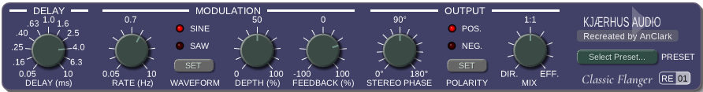

# Classic Flanger RE-01

Classic Flanger RE-01 is a reversed engineering of Kjaerhus Classic Flanger, a studio-quality free flanger plugin. It sounds vintage and analog, bringing a warm and rich character. Suitable for many applications, from your favorite electric guitar, to SFX processing, to vocals and instruments, almost anything you can think of.

It has enhanced features and a modern interface, while still retaining the charm of the original plugin. Due to reverse engineering, its parameters are slightly different from the original plugin, but it still closely mimics the sound and behavior of the original plugin.

This project is open-source and available for free, allowing users to enjoy the classic flanger sound on their modern DAWs and operating systems.



## Background

Classic Flanger was part of Classic Series by Kjaerhus Audio, a Danish company that developed audio plugins. The original plugin was released in the early 2000s and became popular for its high-quality sound and user-friendly interface. However, it was discontinued in early 2010s, leaving many users without access to this beloved flanger.

Several DAWs like Acoustica Mixcraft included Classic Flanger as a built-in plugin, but it was only available on Windows, and it only had a 32-bit VST2 version. Modern 64-bit-only DAWs and non-Windows users were left out of the fun.

Years later, in 2026, I (AnClark Liu) decided to reverse engineer the Classic Flanger to bring it back to life. The result is this open-source implementation that closely mimics the sound and behavior of the original plugin. Now it's available in a modern format, compatible with today's DAWs and operating systems.

## Features

- High-quality flanger algorithm that captures the essence of the original Classic Flanger.
- Tuneable delay time, depth, and feedback parameters for precise control over the flanging effect.
- Support for choosing different LFO waveforms (sine, sawtooth), bringing a slightly different flavor to the flanging effect.
- Allows users to switch polarity of the LFO, which extends the range of modulation possibilities.
- Bring back the original panel design and controls with modern technology.
- Multi-platform support, including Windows, macOS, and Linux.
- Multiple plugin formats, including VST 2.4, VST3, CLAP, LV2 and JACK standalone (optional).
- Advanced preset management system, allowing users to save and load their favorite flanger settings.
- Shipped with a collection of factory presets that cover common flanger styles.

## How to Compile

To compile the Classic Flanger RE-01 plugin, you will need to have the following dependencies installed:

- CMake (version 3.15 or higher)
- A C++ compiler that supports C++17 (e.g., GCC, Clang, MSVC)

1. Clone the repository:

   ```bash
   git clone --recurse-submodules https://github.com/AnClark/ClassicFlanger-RE01.git
   cd ClassicFlanger-RE01
   ```

2. Configure the build:

   ```bash
   cmake -S . -B build -DCMAKE_BUILD_TYPE=Release
   cmake --build build
   ```

3. The compiled plugin will be located in the `build/bin` directory.

## Build Classic Flanger by Pipeline

Classic Flanger RE-01 provided Makefiles, allowing you to build and pack Classic Flanger RE-01 in a pipeline. It resembles CI/CDs like GitHub Actions and Jenkins, but it has more convenience for building locally.

### Native build for current platform

Open a Unix-compatible environment (Msys2 on Windows, Bash on Linux), then run:

```bash
make
```

You will get a package file named as `build\ClassicFlanger-RE01-{ARCH}-{OS}-{VERSION}-{GIT_COMMIT_ID}.zip`.

> NOTICE:
>
> macOS is not supported yet in this Makefile, since I (AnClark) does not have a Mac and cannot test on macOS. Feel free to submit a PR if you could give me a hand!

### Cross-build for Windows on Linux / macOS

Another Makefile `Makefile.win32_cross.mk` is for cross-compiling RE-01 for Windows on Linux or macOS. Simply run:

```
make -f Makefile.win32_cross.mk
```

### Dependency check

Makefiles will inform you if you miss some dependencies. Look into source files to figure out what you should install.

## Tools used

- **Ghidra**: For disassembling and decompiling the original plugin's binary to understand its inner workings and behavior.
- **IDR**: Classic Series were written in Delphi. IDR was used for generating IDC script for recovering Delphi-specific symbols and structures (e.g. `ASCIIString`).
- **Dhrake**: For applying the generated IDC script to the Ghidra project, which helps in understanding the code structure and logic. (You can see Dhrake as a "demangler" for Ghidra, which marks up the Delphi-specific stuffs in a more readable way.)
- **Kimi Agent K2.7**: For researching the decompiled code, and for assisting in the development process.

## DISCLAIMER

This project is a reverse engineering effort and is not affiliated with Kjaerhus Audio or any of its former employees. The original Classic Flanger plugin was developed by Kjaerhus Audio, and this implementation is an independent recreation based on the original's behavior and sound.

This project is not affliated with Acoustica LLC, and other manufacturers that included Classic Flanger in their products.

The Kjaerhus logo in the plugin UI is used under fair use for non-commercial purposes, to describe where the original Classic Flanger plugin came from.

## License

This project is licensed under the GPLv3 License. See the [LICENSE](LICENSE) file for details.

Components in `widgets/imgui-ext` and `widgets/imgui-knobs-mod` are licensed under the MIT License, while `widgets/dpf-imgui` is licensed under the ISC License. See the respective LICENSE files in those directories for details.
